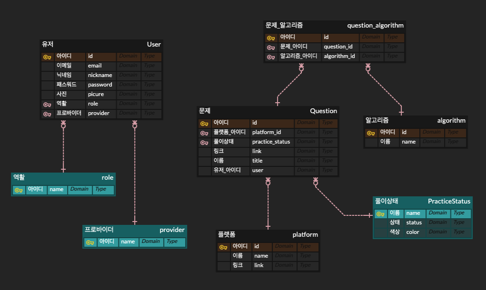
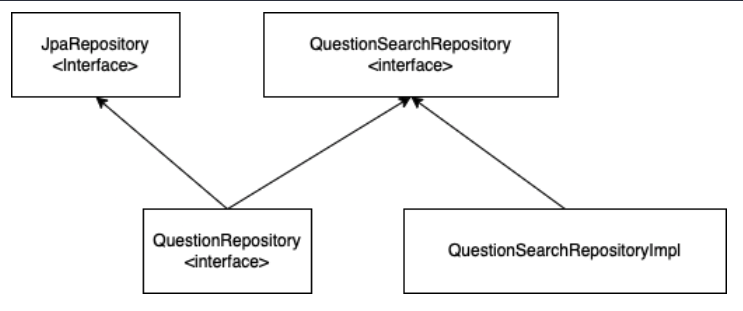

# ['리멤버'](https://rememberandpass.herokuapp.com) 기술 노트 (작성중...)

## 0. 기술스택
#### 백엔드
- SpringBoot 
  - Spring web (MVC + tomcat)
  - Spring security
  - Spring oauth2 client (소셜로그인)
  - Spring data jpa
  - Spring data rest
- lombok
- jdbc mariadb, flyway(DB 형상관리), querydsl

#### 프론트
- thymeleaf
- jquery
- bootstrap, bootstrap-select (폼 select)
- alertify (알람 라이브러리)


## 1. 스프링부트로 개발시작
리멤버 개발을 위해 기존에 공부했던 Django 프레임워크를 사용할까 잠깐 고민을 했습니다.
하지만 많은 기업에서 백엔드 프레임워크로 스프링을 사용하고 있음이 느껴져서, 스프링을 공부해보면 좋을것 같다는 판단이 섰습니다.
스프링부트는 스프링 생태계의 모듈들의 의존성 관리를 도와줘서 스프링에 입문하는데 큰도움이 되었습니다.

```shell
plugins {
  id 'org.springframework.boot' version '2.6.7'
  id 'io.spring.dependency-management' version '1.0.11.RELEASE'
  id 'java'
}

dependencies {
	implementation 'org.springframework.boot:spring-boot-starter-data-jpa'
	implementation 'org.springframework.boot:spring-boot-starter-data-rest'
	implementation 'org.springframework.boot:spring-boot-starter-security'
	implementation 'org.springframework.boot:spring-boot-starter-oauth2-client'
	implementation 'org.springframework.boot:spring-boot-starter-validation'
}
```
위와 같이 특정버전의 'org.springframework.boot' 플러그인을 설치하면 하면 스프링부트 버전의 spring-boot-dependencies bom을 받아옵니다. 
그래서 스프링 생태계의 프레임워크나 같이 자주쓰이는 라이브러리들에 한해서는 버전의 명시를 따로 해줄필요가 없어집니다. 

구글링을 해보니 
'io.spring.dependency-management' 플러그인도 추가하면 'org.springframework.boot' 플러그인이 감지해서 더 좋은 의존성 관리기능을 제공한다고 
합니다. 자바 플러그인은 src/main/java 아래에 있는 파일을 Source로 하여 빌드할수 있도록 돕는것 같습니다.

스프링을 공부하면서 놀랐던것은 django의 경우 거의 모든 기능이 하나의 프레임워크에 포함되어있었지만, 
Spring은 기능들이 서로 다른 프레임워크로 쪼개져 있었습이다. 따라서 필요한 기능을 제공하는 스프링의 프레임워크들을 찾아서
gradle 의존성에 추가해주는 작업이 필요했습니다.

그래서 Spring web (MVC + tomcat), Spring 시큐리티(보안), Spring oauth2 client(소셜로그인), 
Spring data jpa(편리하게 리파지토리 생성), Spring data rest(restful한 response object 생성)등의
프레임워크들을 추가해주었고, 편리하게 생성자를 생성해주는 롬복, JPQL 쿼리를 도와주는 Querydsl을 의존성에 추가했습니다.

## 2. 역활을 명확히 나누어서 설계해보자
스프링를 공부하기 위해 이동욱님이 저술한 '스프링부트와 AWS 혼자 구현하는 웹서비스' 라는 책을 읽게 되었습니다. 책을 읽다보니
객체의 책임을 Controller, Service, Repository, Domain, DTO 로 나누는모습을 볼수 있었고, 
동욱님이 권장하는 설계를 해보기로 마음을 먹었습니다.

아래의 예시들은 제가 역활을 나누어서 설계해본 '내가 푼 문제들' 서비스의 상세페이지 기능을 담당하는 코드들입니다.

```java
/*
 * 컨트롤러 예제
 */
@GetMapping("/{id}")
public String findById(Model model, @PathVariable Long id) {
    QuestionResponse question = service.findById(id);

    /*
     * modeling
     */
     model.addAttribute("question", question);
     model.addAttribute("practiceStatusus", practiceStatususService.findAll());
     return "users/questions/detail";
     
}

// 프론트엔드 분리시 이렇게 리펙토링도 가능합니다.
@GetMapping("/{id}")
public QuestionResponse findById(@PathVariable Long id) {
    return service.findById(id);
}
```
Controller는 특정 uri로 요청을 받아 처리를 서비스에 위임하고, 타임리프 랜더링을 위한 모델 셋팅에만 집중하도록 설계했습니다.
제가 향후에 백엔드와 프론트엔드를 분리하여 설계하게 되면, 프론트에서 JSON 응답을 받아 렌더링하기때문에 모델이 필요없어집니다.

```java
/*
 * 서비스 예제
 */
private final QuestionAssembler assembler;
private final AuthenticatedFacade authenticatedFacade;
private final QuestionRepository repository;

public QuestionResponse findById(Long id) {
    Question question = getById(id);

    authenticatedFacade.checkResourceOwner(getUserOfQuestion(question));

    return assembler.toModel(question);
}

private Question getById(Long id) {
    return repository.findById(id).orElseThrow(
        () -> new RememberException(ErrorCode.NOT_FOUND, "해당 문제를 찾을수 없습니다."));
}
```
사용자의 문제를 읽어오기 위해 리파지토리에 findbyid 요청을 해서 Question을 가져옵니다.
그리고 Question의 유저가 현재로그인된 유저인지 검사한후 QuestionResponse로 변환하여 컨트롤러에 던져주게 됩니다.

이처럼 Service는 Domain들에 요청을 보낸후 그 결과들을 조합하는데 집중합니다. 사용자가 원하는 서비스를 위해 처리하는 코드는 되도록 service에 기술하지 않고
다른 보조 서비스나 도메인에 위임하도록 설계했습니다.

```java
/*
 * QuestionResponse DTO
 */
public class QuestionResponse extends RepresentationModel<QuestionResponse> {
  private Long id;
  private String title;
  private String link;
  private PracticeStatusResponse practiceStatus;
  private PlatformResponse platform;
  private List<AlgorithmResponse> algorithms;

  public static QuestionResponse of(Question question,
                                    PlatformResponse platform,
                                    PracticeStatusResponse practiceStatus,
                                    List<AlgorithmResponse> algorithms) {
    return new QuestionResponse(
            question.getId(), question.getTitle(), question.getLink(),
            practiceStatus, platform, algorithms
    );
  }

  public QuestionResponse setSelfLink(String path, Object id) {
    this.add(LinkBuilder.getDetailLink(ServerContext.getRoot(), path, id).withSelfRel());
    return this;
  }
}
```
DTO는 각계층에서 사용되는 객체들의 변환을 담당합니다. 서비스에서 Question 객체를 그대로 던져주지 않고 QuestionResponse로 변환하여
반환해줌으로써 컨트롤러와 서비스의 결합도를 낮출수 있습니다.

## 3. 데이터베이스 스키마 설계
제가 세웠던 유저스토리의 첫번째는 '사용자는 자신이 풀었던 알고리즘 문제들에 대한 정보(링크, 문제이름등...)를 저장할수 있다' 입니다.
이 유저스토리를 만족하기 위해서는 문제, 알고리즘, 트래이닝 플랫폼, 풀이상태 등의 테이블이 필요했고, 
자신이 등록한 문제들을 관리할수 있어야 하기 때문에 회원정보를 가지고 있는 유저 테이블등이 필요했습니다.

저는 [ERDCloud](https://www.erdcloud.com/) 서비스를 이용하여 아래와 같이 스키마를 설계했습니다. 
검정색은 실제 데이터베이스 테이블, 청록색은 Enum으로 표시했습니다.



## 4. 풀이상태를 표현하기 위해 ENUM 사용
기존에는 풀이상태를 표현하기 위해서 데이터베이스 테이블을 생성하여 관리했습니다. 그리고 유저가 생성했던 문제와 함께 풀이상태를 같이 읽어올수 있도록 
fetch join 기법을 사용했었습니다. 아래와 같이 말이죠

```java
 @Override
public Optional<Question> findById(Long id) {
    QQuestion question = QQuestion.question;

    JPAQuery<Question> query = queryFactory
        .select(question)
        .from(question)
        .innerjoin(question.practiceStatus).fetchjoin()
        .where(question.id.eq(id));
    return Optional.ofNullable(query.fetchOne());
}
```

Querydsl을 사용해서 fetch 조인을 쉽게 사용하여 쿼리횟수를 줄일수 있었지만 좋은 설계로 보이지는 않았습니다. 왜냐하면 풀이상태에 저장될 컬럼은
'PERFECT', 'GREAT', 'GOOD', 'FAIL'의 총4개에 풀과하기 때문입니다. 그러던중 
우아한형제들에서 운영하는 기술블로그의 [Java Enum 활용기](https://techblog.woowahan.com/2527/) 읽게 되었습니다. 이 포스팅에선
제가 생각한 문제를 정확하게 지적하고 있었고 이를 ENUM을 통해 해결하는모습을 보여줘서 그대로 따라해보기로 했습니다.

```java
public enum PracticeStatus {
    /*
     * datas
     */
    PERFECT("PERFECT", "#00ff00"),
    GREAT("GREAT", "#aaff00"),
    GOOD("GOOD", "#ffdb4d"),
    FAIL("FAIL", "#ff3333");


    private static List<PracticeStatus> allList;

    private final String STATUS;
    private final String COLOR;

    /*
     * constructor
     */
    PracticeStatus(String STATUS, String COLOR) {
        this.STATUS = STATUS;
        this.COLOR = COLOR;
    }

    public String getStatus() {
        return STATUS;
    }

    public String getColor() {
        return COLOR;
    }
}
```
기존의 @Entity 어노테이팅이 되었던 PracticeStatus 를 Enum으로 리펙토링 했습니다. 이제
쿼리를 날릴때 fetchjoin을 해줄 필요가 없어졌고, 새로운 속성이 추가될경우엔 ENUM값을 추가해주기만 하면 됩니다.
이와 마찬가지로 Platform(백준, 프로그래머스 ...) 역시 Enum으로 리펙토링할 계획을 가지고 있습니다.

```java
private static List<PracticeStatus> allList;

public static List<PracticeStatus> findAll() {
    if (Objects.isNull(allList)) {
        allList = List.of(PracticeStatus.values());
    }
    return allList;
}
```
유저가 풀이상태를 업데이트하려면 어떤 상태들이 있는지 알아야 하기 때문에 모든 상태들을 불러올 경우가 많습니다. enum이 제공하는 
values() 메소드는 호출시마다 새로운 배열을 생성합니다. 그래서 싱글톤 패턴을 사용하여 
풀이상태 리스트를 한번 생성해놓고, 서비스에서 필요할 불러쓰는 방식으로 최적화했습니다. 

하지만 이패턴엔 문제가 있는데, 멀티쓰레드 환경이라 가정했을때, 싱글톤임에도 불구하고 리스트 객체가 2번이상 생성될 위험이 있습니다.
그래서 다음과 같은 형태로 리펙토링 했습니다.

```java
private static List<PracticeStatus> allList;

public static synchronized List<PracticeStatus> findAll() {
    if (Objects.isNull(allList)) {
        allList = List.of(PracticeStatus.values());
    }
    return allList;
}
```

```java
private volatile static List<PracticeStatus> allList;

public static List<PracticeStatus> findAll() {
    if (Objects.isNull(allList)) {
        synchronized (PracticeStatus.class) {
            allList = List.of(PracticeStatus.values());
        }
    }
    return allList;
}
```
이방식들은 차례대로 싱글톤객체를 만들때 'synchronized', 'Double Checked Locking' 기법을 활용한것입니다. 
DCL 기법의 경우, 리스트가 생성되어있는지 확인한다음, 생성이 안되어있으면 동기화를 설정해줍니다.
PracticeStatus 클래스의 메소드들에 대해서 synchronized가 설정되면
다른 병행되는 쓰레드가 같은 클래스의 메소드접근시 대기하도록 만들어줍니다.
따라서 항상 동기화를 거는 첫번째 방법보다 효율적입니다.

volatile 키워드를 추가하게 되면, CPU캐시를 사용하는 non-volatile과 반대로
항상 메인메모리에 저장(Write는 바로 flush)하고 읽어오기 때문에 변수 값 불일치 문제를 해결 할 수 있습니다.
하지만 결국 상태리스트를 불러오는경우는 반드시 발생하기때문에, 초기화 여부를 확인후 구현체를 만드는것 보다
프로그램 시작시 아래와 같이 초기화 시켜버리기로 했습니다.

```java
private static List<PracticeStatus> allList = List.of(PracticeStatus.values());

public static synchronized List<PracticeStatus> findAll() {
    return allList;
}
```

## 5. 엔티티의 공통된 컬럼을 분리하여 추상클래스로 분리하기
```java
@Entity
@EntityListeners(AuditingEntityListener.class)
public class Platform {
  @Id
  @GeneratedValue(strategy = GenerationType.IDENTITY)
  private Long id;

  @Column(length = 100, nullable = false)
  private String name;

  @Column(length = 255, nullable = false)
  private String link;

  @CreatedDate
  private LocalDateTime createdDate;

  @LastModifiedDate
  private LocalDateTime modifiedDate;
}
```
중요하지는 않지만 테이블의 튜플들이 생성될때 생성날짜와 업데이트날짜를 집어넣고 싶었습니다. 기존에는 위와 같이 클래스에 직접
createdDate, modifiedDate 필드를 직접 선언해주었습니다. 이때 @EntityListeners(AuditingEntityListener.class) 
어노테이션을 이용하면 자동으로 시간을 매핑하여 튜플에 넣어줍니다. 

하지만 이코드들을 모든 entity에 일일히 집어넣어주는것은 귀찮은일입니다. 
그래서 audit 기능을 가지고 있는 추상클래스를 만들고, 이를 다른 entity 클래스에서 상속해서 사용하도록 구현했습니다. @MappedSuperclass 어노테이션은 
상속한 필드들을 컬럼으로 인식시키는 기능을 합니다.

```java
@MappedSuperclass
@EntityListeners(AuditingEntityListener.class)
public abstract class BaseTimeDomain {
    @CreatedDate
    private LocalDateTime createdDate;

    @LastModifiedDate
    private LocalDateTime modifiedDate;
}

// 이렇게 바꿔줍시다
@Getter
@NoArgsConstructor
public class Platform extends BaseTimeDomain {
  @Id
  @GeneratedValue(strategy = GenerationType.IDENTITY)
  private Long id;

  @Column(length = 100, nullable = false)
  private String name;

  @Column(length = 255, nullable = false)
  private String link;
}
```

마지막으로, 스프링 부트의 main 메소드가 있는 클래스에 @EnableJpaAuditing 어노테이션을 적용하여 
JPA Auditing을 활성화 헤주면 됩니다.

```java
@EnableJpaAuditing
@SpringBootApplication
public class CoreApplication {
	public static void main(String[] args) {
		SpringApplication.run(CoreApplication.class, args);
	}
}
```

## 6. DB에 접근하기 위한 레파지토리 만들기
```java
public interface AlgorithmsRepository extends JpaRepository<Algorithm, Long> {}
```
'Spring data jpa' 는 JpaRepository를 통해 crud, 페이징등의 편리한 기능을 제공합니다. 데이터베이스에 대한 접근을 담당하는
구현체는 어플리케이션이 시작되면서 자동으로 만들어줍니다. 스프링부트는 configuration에 @EnableJpaRepositories 이 자동으로 등록되어
@Repository 어노테이션을 달아줄 필요가 없습니다. 하지만 약간의 문제점이 있었습니다.

```java
public interface QuestionsRepository extends JpaRepository<Question, Long> {}
```
위와 같이 문제들에 대한 CRUD와 페이징 기능등을 제공하는 리파지토리를 만들었지만, Question은 알고리즘과 플랫폼에 대한 정보를
외래키로 가지고  있습니다. JPA의 로딩방식은, 외래키로 설정된 엔티디들을 필요할때 불러오게 됩니다. 

따라서 문제하나를 읽어오면 그와 연관된 알고리즘과 플랫폼을 가지고 오는 2번의 쿼리가 추가로 발생하여, 총 3번의 쿼리가 필요합니다. 이는 collection을 읽어올때 더큰문제인데
문제들을 읽어오는 쿼리 + 문제와 연관된 다른필드 * 문제수 만큼의 쿼리 횟수가 발생하기 때문입니다. 이문제를 N+1 이라고 부르며, 해결을 위해
findbyid, findall 메소드들에 대해 fetch join등의 커스텀한 로직이 필요하게 되었습니다. 



[동욱님의 블로그](https://jojoldu.tistory.com/372) 를 읽어보면 커스텀 Repository를 
JpaRepository 상속 클래스에서 사용할 수 있도록 기능을 지원합니다.
그래서 위구조를 본따 검색기능을 제공할 QuestionSearchRepository 인터페이스와 
QuestionSearchRepositoryImpl 구현체를 만들었습니다. 
QuestionRepository는 JpaRepository와 QuestionSearchRepository 인터페이스를 상속합니다. 그리고 어플리케이션 실행시
Jpa 에서 제공되는 구현체와 QuestionSearchRepository에 해당하는 기본구현체(.impl)를 로딩하게 됩니다.

```java
public Optional<Question> findById(Long id){
    QQuestion question=QQuestion.question;

    JPAQuery<Question> query = queryFactory
        .selectDistinct(question)
        .from(question)
        .innerJoin(question.platform).fetchJoin()
        .leftJoin(question.algorithms).fetchJoin()
        .where(question.id.eq(id));

    return Optional.ofNullable(query.fetchOne());
}
```
위의 코드는 QuestionSearchRepositoryImpl 구현체의 findbyid를 새로구현한 예제 입니다. 문제하나는 무조건 하나의 플랫폼과 
대응되므로 플랫폼을 내부 조인한후 패치조인 합니다. 문제는 알고리즘들을 가지고 있을수도, 없을수도 있어서 left 외부조인후 패치조인
해주었습니다. left 조인 사용하면 결과가 여러개일수 있으므로 selectdistinct를 사용했습니다. 다음은 findbyId 호출시 발생하는 쿼리입니다.
```java
Hibernate:
    select
        distinct question0_.id as id1_3_0_,
        platform1_.id as id1_1_1_,
        algorithm3_.id as id1_0_2_,
        ......
    from
        question question0_
    inner join
        platform platform1_
        on question0_.platform_id=platform1_.id
    left outer join
        question_algorithm algorithms2_
        on question0_.id=algorithms2_.algorithm_id
    left outer join
        algorithm algorithm3_
        on algorithms2_.question_id=algorithm3_.id
    where
        question0_.id=?
```
하지만 dictinct 를 사용해도 일단 조인된 모든 튜플들을 가지고 오는것으로 추정됩니다. 튜플들을 가져오면 클라이언트(JPA)
단에서 question_id를 이용해 dictinct를 처리해줍니다.
