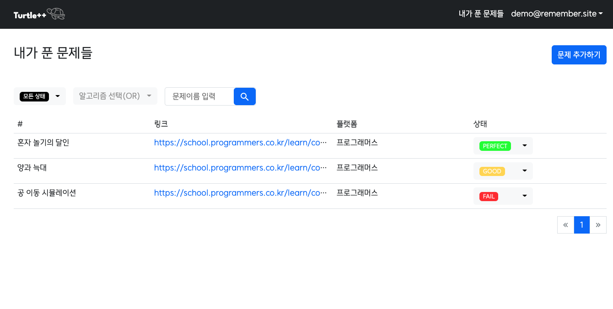

# 코딩테스트 복습을 위한 ['리멤버'](https://rememberandpass.herokuapp.com)

## 어떤 서비스 인가요?

리멤버는 신선한참치가 개발한 코딩테스트문제 복습을 도와주는 웹서비스 입니다.
 
자기가 풀었던 문제에 대한 정보(이름, 링크)를 저장할수 있는 '내가 푼 문제' 기능을 제공하고 있습니다.
 
또한 문제에 대한 학습 상태(FAIL, GOOD, GREAT, PERFECT)를 같이 저장하여, 향후 어려웠던 문제부터 우선순위를 정해 복습을 할수 있도록 돕습니다.
 
[링크](https://rememberandpass.herokuapp.com) 를 클릭하여 현재 개발중인 데모 서비스를 이용하실수 있습니다.

## 기술 노트
[링크](./docs/tech) 를 클릭하여 프로젝트에 사용된 기술 및 개발스토리를 보실수 있습니다.

## 유저스토리
#### 1. 사용자는 자신이 풀었던 알고리즘 문제들에 대한 정보(링크, 문제이름등...)를 저장할수 있다. (O)
#### 2. 사용자는 저장했던 문제들에 대해 해결했던 기록들을 확인할수 있다.
#### 3. 사용자는 저장했던 문제들을 이용하여 문제집을 생성할수 있고 이를 활용 및 공유할수 있다.

## 로드맵
#### 스프린트 1
- 유저스토리 1 구현 (O)

#### 스프린트 2
- 프론트(VueJS), 백엔드(SpringBoot) 분리
- 스프린트1 버그 수정 및 리펙토링
- 유저스토리 2,3 구현

## 서비스 사용 방법

서비스에 대한 간단한 설명이 적혀있으며 로그인, 회원가입, '내가 푼 문제들' 페이지로 이동할수 있는 메인페이지 입니다.

직접 이메일과 패스워드를 기입하여 회원가입을 진행할수 있고, 구글 소셜로그인도 가능합니다.
 
회원가입이 끝나면 자동으로 로그인이 되어 리멤버의 핵심기능인 '내가 푼 문제들' 서비스로 이동됩니다.

'내가 푼 문제들' 페이지로 이동하면, 등록한 코딩테스트 문제들과 학습 상태를 볼수 있습니다. '문제 추가하기'를 통해 새로운 문제를 추가할수 있고, 검색필터를 통해 문제를 빠르게 찾을수 있습니다.

풀이상태를 'fail', 알고리즘은 '정렬' or '구현', 문제이름에 '추석' 으로 검색한 예시입니다. 
저는 가장 실력이 부족한 문제부터 복습하기 위해 상태별 검색(FAIL, GOOD, GREAT, PERFECT)을 가장 많이 활용하고 있습니다.

문제에 대한 복습이 끝나면, 이해도에 따라서 학습 상태를 편집해주는 일이 빈번하게 발생할것 같았습니다. 
  그래서 풀이상태에 한해서는
폼을 불러우지 않고 ajax 형태로 바로 편집할수 있는 기능을 만들었습니다.

'문제 추가하기' 버튼을 클릭하여 문제를 생성하는 예시입니다. 문제이름과 플랫폼, 학습상태, 문제링크(선택)을 지정할수 할수 있습니다.
 
필요에 따라 알고리즘을 추가할수 있으며 다중 선택을 지원합니다.

문제가 추가되면 바로 상세페이지로 이동할수 있습니다.

상세페이지에선 문제에 대한 정보와 함께, 관련 알고리즘 정보까지 모두 보여줍니다. 
풀이 상태 수정을 바로 할수 있고, 문제 수정 및 삭제를 할수 있습니다.  

문제 수정페이지입니다. 학습 상태뿐만아니라 문제의 모든 속성(문제이름과 플랫폼, 문제링크, 알고리즘)을 편집할수 있습니다.

## 참고자료
https://to-dy.tistory.com/86
https://medium.com/digitalfrontiers/spring-hateoas-avoid-linkto-for-resource-links-1abcf4a442d2
https://velog.io/@kiwonkim/MVC2-%ED%83%80%EC%9E%84%EB%A6%AC%ED%94%84-%EA%B8%B0%EB%B3%B8%EA%B8%B0%EB%8A%A5
https://www.baeldung.com/thymeleaf-select-option
https://blog.naver.com/PostView.naver?blogId=writer0713&logNo=221853596497&redirect=Dlog&widgetTypeCall=true&directAccess=false
https://mungto.tistory.com/438
https://stackoverflow.com/questions/32442408/preauthorize-not-working-on-controller
